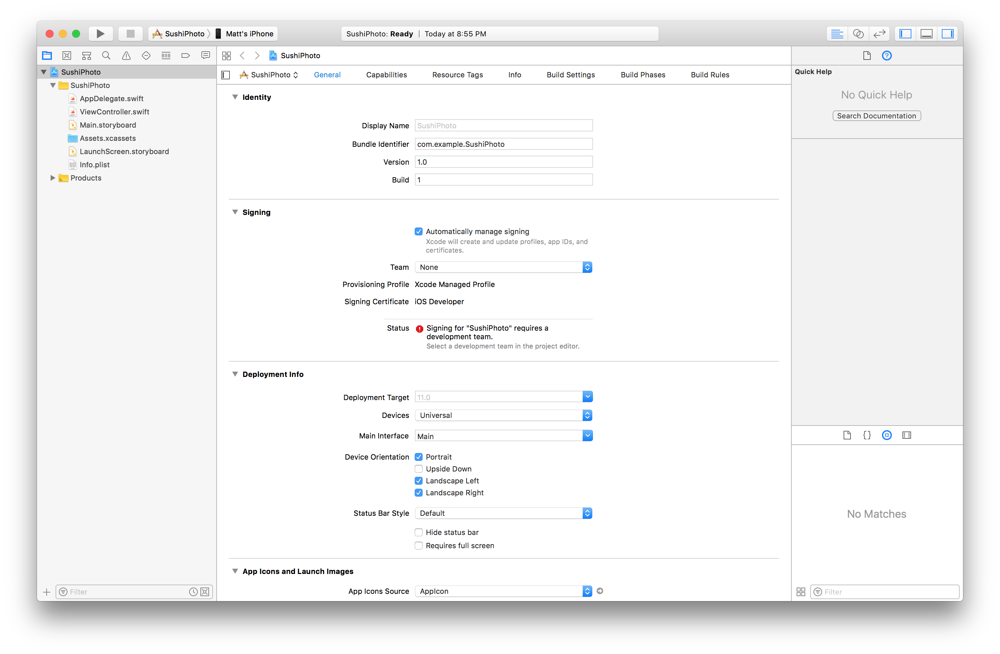
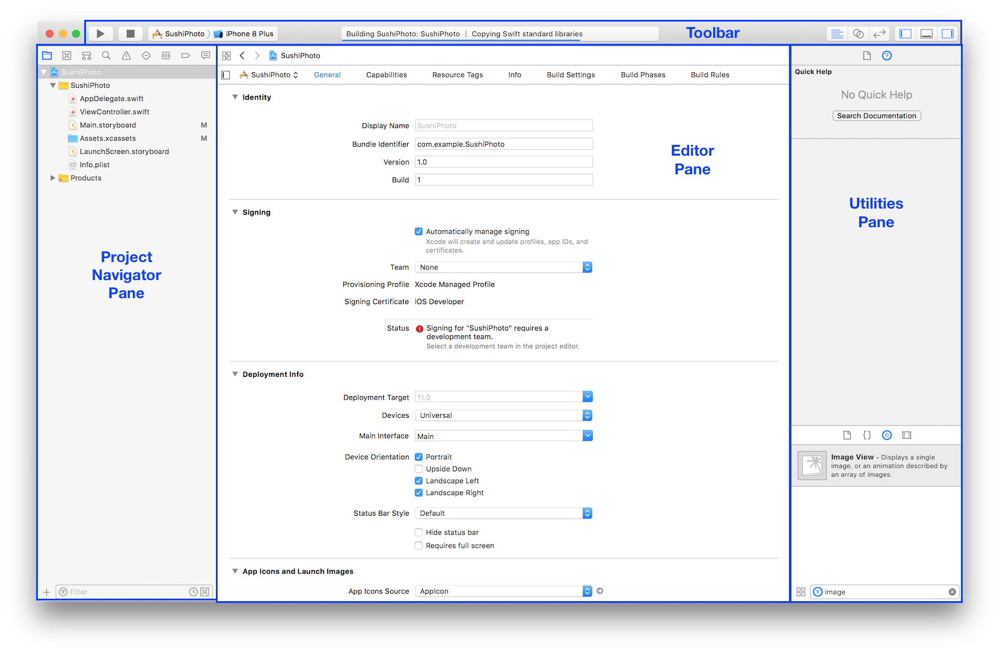
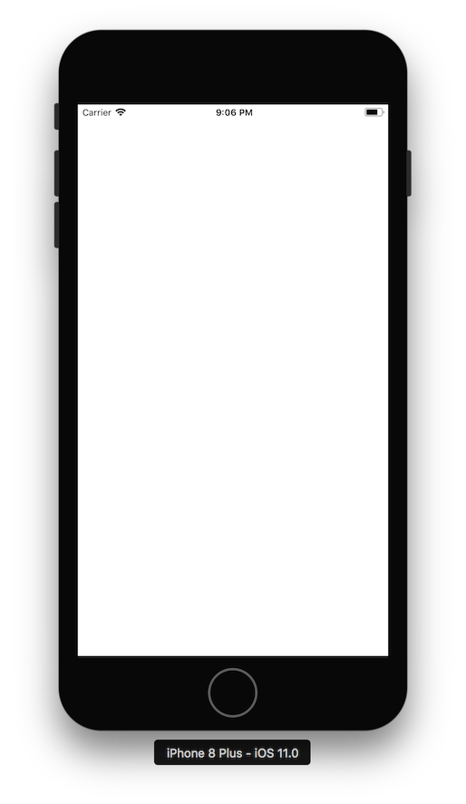
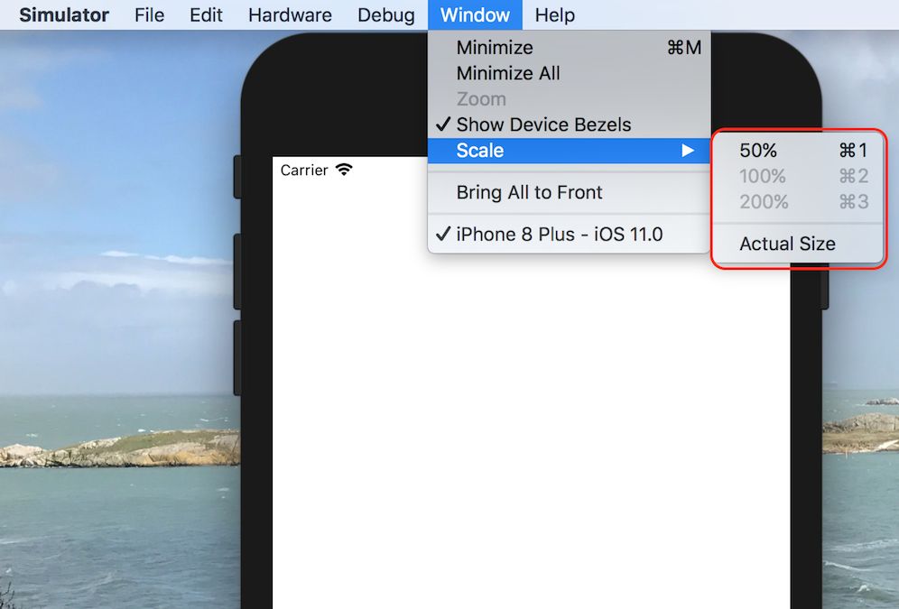

# A Tour of the Xcode Interface

Your app should look like this, after following the setup guide:

Xcode is primarily made up of a toolbar, project navigator pane, editor pane, and utilities pane.

Click on the Run button

the simulator will launch with a blank white screen.

If Xcode asks you to enable Developer Mode on your Mac to give Xcode access to certain debugging features without you having to enter your password every time, you can choose to enable developer mode and you will be prompted for your password. If you do not, you may have to enter your password at a later time.

To get back to Xcode, you can use  &#8984;-tab to invoke the app switcher to switch between the simulator and Xcode.

If the phone in the simulator is too zoomed or too small, you can change the scale from the Window > Scale menu. 

Alternatively, you can click, drag, and resize the phone from the corners of the phone.

